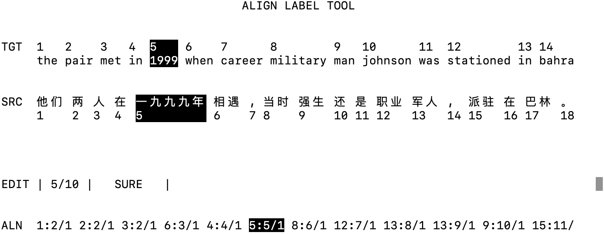

# word alignment labeling tool

A commend line tool for labeling alignments of parallel sentences.

Designed and implented by Charles Xin-Tong Li



## Usage

Label alignments for source file and target file.

```shell
chmod +x alt.py
./alt.py source target alignment
```

View alignments for source file and target file with no modification.

```shell
./alt.py -v source target alignment
```

**Key bindings**

| key       | Description                        |
| --------- | ---------------------------------- |
| `q`       | quit and save                      |
| `n`       | next target word                   |
| `p`       | previous target word               |
| `w`       | move forward by a source word      |
| `b`       | move backward by a source word     |
| `a`       | move alignment right by 10 char    |
| `d`       | move alignment left by 10 char     |
| `s`       | toggle SURE and POSSIBLE           |
| `<num>`   | input a selection number           |
| `>`       | next sentences                     |
| `<`       | previous sentences                 |
| `L`       | go to selected sentences           |
| `<space>` | toggle alignment of selected words |

## Data

`source` and `target` should be parallel corpus. `alignment` should be alignment file corresponding to these two corpus. If `alignment` does not exits, it will be created. The form of align data should be `<source_word>:<target_word>/<sure=1/possible=0>`.
